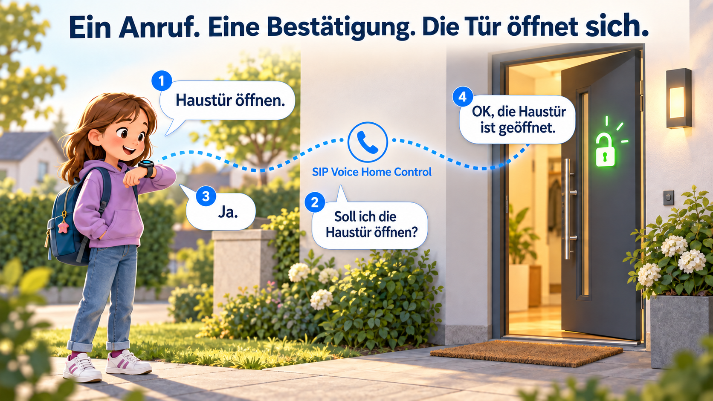

# SIP Voice Home Control



Lokale Sprachsteuerung für openHAB über Telefonanrufe an eine FRITZ!Box.
Ein Linux-Docker-Container, CPU-Verarbeitung, kein LLM, keine Cloud-Sprachdienste.
Ausgelegt für kurze deutsche Befehle, beispielsweise von einer Xplora-Uhr.

## Nutzung auf eigene Gefahr und Verantwortung

**Installation, Konfiguration und Nutzung erfolgen auf eigene Gefahr und in eigener
Verantwortung.** Jede Person muss selbst abwägen und prüfen, ob, wie und unter
welchen Sicherheitsvorkehrungen sie diese Anwendung in ihrer Umgebung einsetzt.
Beispiele und vorgeschlagene Einstellungen ersetzen diese individuelle Prüfung nicht.

Die Anwendung kann reale Geräte wie Haustüren und Garagentore steuern.
Fehlkonfigurationen, Fehlinterpretationen, unbefugter Zugriff oder technische
Störungen können unerwünschte Aktionen und Schäden verursachen. Betreiber sind
für ihre Zugriffsfreigaben, Netzwerksicherheit, Geräteanbindung, Tests und den
sicheren Betrieb verantwortlich. Vor einer Freigabe müssen insbesondere
Berechtigungen, Bestätigungen, Geräterückmeldungen und das Verhalten bei Ausfällen
in der eigenen Installation geprüft werden. Vorhandene Schutzvorrichtungen dürfen
nicht durch diese Anwendung ersetzt oder außer Kraft gesetzt werden.

**Die Software wird „wie sie ist“ (AS IS) in ihrem jeweils vorhandenen
Entwicklungsstand bereitgestellt.** Ob sie für den vorgesehenen Einsatz geeignet
ist und welche Anpassungen erforderlich sind, muss jede nutzende Person selbst
prüfen und entscheiden.

## Entwicklungsstand

**Status:** Erste Implementierung. Automatisierte Kerntests sind vorhanden.
Die reale SIP-/RTP-Verbindung, Verständlichkeit an der Uhr und physische
Geräterückmeldungen müssen vor dem produktiven Einsatz abgenommen werden.
Alle Aktionen und Anruferfreigaben sind in der Beispielkonfiguration deaktiviert.
Bereits durchgeführte Prüfungen stehen in [VALIDATION.md](docs/VALIDATION.md).

## Dokumentation

- [HTTPS-Konfigurationsoberfläche](docs/WEB_UI.md): YAML-Editor, Validierung,
  Versionen, Upload/Download, Status, RAM-Logs und Passwort-Reset per Konsole.
- [Automatische Images in GHCR und Docker Hub](docs/REGISTRY.md): Build, Tests,
  Veröffentlichung, Registry-Zugang und Installation ohne lokalen Build.

- [Alle Konfigurationsparameter](docs/CONFIGURATION.md): Pflichtfelder,
  Standardwerte, Wertebereiche, Abhängigkeiten, Kommandozeile und Docker-Einstellungen.
- [Protokolle und gespeicherte Daten](docs/LOGGING_AND_DATA.md): Log-Inhalte,
  Rufnummernspeicherung, Ansagen-Cache, Aufbewahrung, Diagnose und Log-Befehle.
- [Geräte konfigurieren](docs/DEVICE_CONFIGURATION.md): Items, Statuszuordnung,
  Invertierung, Bestätigungsfragen sowie Garage öffnen und schließen.
- [Gesprächsdiagramm mit allen Ansagen](docs/CALL_FLOW.md).
- [Teststand](docs/VALIDATION.md) und [Abnahmecheckliste](docs/ACCEPTANCE.md).

- [Betrieb, Anrufsteuerung, RAM-Status und Adapter](docs/OPERATIONS.md).
- [openHAB-Anrufsteuerung einrichten und bedienen](docs/OPENHAB_CONTROL.md).
- [Push-Benachrichtigungen mit Namen und Aktionen](docs/OPENHAB_NOTIFICATIONS.md).

## Funktionen

- Registrierung als SIP-Telefon an der FRITZ!Box, Audio über G.722/G.711.
- Rufnummer und Begrüßungsname werden gemeinsam konfiguriert.
- Pro Rufnummer Rückrufschutz (`callback`, Standard) oder direkte Annahme (`direct`).
- Rückruf ausschließlich an die hinterlegte Nummer; konfigurierbare Begrenzung der Versuche im RAM (0 = unbegrenzt).
- Einstellbare Pause nach Gesprächsannahme, standardmäßig eine Sekunde.
- „Öffne die Haustür“, „Tür öffnen“, „schließe die Tür auf“, „Tür aufschließen“
  und weitere konfigurierte Satzmuster führen zur gleichen Aktion.
- Bestätigung erst nach einer neuen openHAB-Geräterückmeldung; ein gemeinsames
  Befehls-/Status-Item ist mit deaktiviertem autoupdate ebenfalls möglich.
- Item-Namen, Statusbedeutung und normale/invertierte Prozentwerte vollständig in YAML.
- Aktionen im selben Gespräch beliebig erneut anfordern; „Nein“ beendet die Folgefrage.
- Optionale Bestätigungsfrage je Aktion; Ausführung erst nach einem expliziten „Ja“.
- Erweiterung um Lichtaktionen über Konfiguration, ohne ein Sprachmodell umzuprogrammieren.

## Schnellstart auf Linux (amd64)

Voraussetzungen: Docker Engine mit Compose, Verbindung zur FRITZ!Box und zu openHAB.
Als Ausgangspunkt zwei CPU-Kerne und 2 GB RAM einplanen; reale Last und Latenz messen.
`OWNER` durch den Eigentümer des verwendeten Repositorys ersetzen.

```bash
git clone https://github.com/OWNER/sip-voice-home-control.git
cd sip-voice-home-control
cp config.example.yaml config.yaml
# config.yaml bearbeiten: SIP-Passwort direkt oder Secret-Dateivariante verwenden.
# openHAB, freigegebene Anrufer und Aktionen konfigurieren.
docker compose build
docker compose run --rm controller validate
docker compose run --rm controller doctor
docker compose run --rm controller register --seconds 15
docker compose up -d
docker compose logs -f
```

`register` testet ausschließlich die Anmeldung und weist alle Anrufe ab. Es führt
keine Rückrufe oder Gerätebefehle aus. Diesen Test nicht parallel zu `serve`
mit demselben SIP-Konto/Port betreiben.

Das Image enthält PJSIP, Vosk und Piper samt deutschen Modellen. Downloads erfolgen
beim Build. Beim ersten Start werden die persönlichen Ansagen erzeugt. Danach
benötigt die Sprachverarbeitung keinen Internetzugriff.

**Dateien mit persönlichen Daten:** `config.yaml`, `config.local.yaml`, `config/`,
`secrets/`, `web/`, `.env` und `data/` sind in Git und im Docker-Build-Kontext ausgeschlossen. Passwörter,
echte Rufnummern und private Item-Namen gehören nicht in Beispiele oder Issues.
Beispieladressen und synthetische Rufnummern in Tests sind keine vorkonfigurierten
Zugänge oder freigegebenen Anrufer. Die Beispiel-YAML enthält eine leere Anruferliste.

## FRITZ!Box und Uhr

1. Unter Telefonie → Telefoniegeräte ein LAN/WLAN-IP-Telefon anlegen.
2. Dem Gerät eine eigene eingehende und ausgehende Rufnummer zuweisen.
3. Registrar-IP, SIP-Benutzername und Passwort lokal konfigurieren.
4. Die externe Controller-Rufnummer als erlaubten Kontakt in der Uhr hinterlegen.
5. Die Rufnummer der Uhr mit Namen unter `callers` eintragen. Sie ist im Rückrufmodus
   zugleich das feste Rückrufziel. Die Controller-Rufnummer ist kein erlaubter Anrufer.

Auf Linux verwendet Compose Host-Netzwerk. Standardports: SIP UDP 5062 am Controller,
SIP UDP 5060 an der FRITZ!Box und RTP/RTCP UDP 40000–40010 am Controller.
Bei getrennten VLANs müssen diese Wege einschließlich der tatsächlich von der
FRITZ!Box verwendeten Medienadresse erreichbar sein. Keine Internet-Portfreigabe
für den Controller einrichten. SIP-Anrufe werden nur von `sip.host` akzeptiert.
`sip.public_address` kann die im SIP/SDP angekündigte erreichbare Host-IP festlegen.

Die Compose-Datei ist für natives Linux vorgesehen. Docker Desktop kann für einen
Build verwendet werden; seine Netzwerkeinstellungen erfordern für reale Anrufe
eine eigene Prüfung.

`sip.transport: tcp` verwendet TCP für Registrierung und Rückruf-Signalisierung;
Audio bleibt RTP/UDP. Bei Docker Desktop den SIP-Port entsprechend als TCP sowie
die RTP-Ports als UDP veröffentlichen. Docker Desktop ersetzt bei UDP unter Umständen
die Quell-IP durch seine Gateway-Adresse, wodurch die FRITZ!Box-Prüfung den Anruf
abweist. Im getesteten Aufbau bleibt über die TCP-Verbindung die FRITZ!Box-Adresse
erhalten. Die Absenderprüfung bleibt für beide Transportarten aktiv.

## Anrufer und Rückruf

```yaml
callers:
  - number: "+49..."  # vollständig ersetzen
    name: "Anna"
    access_mode: callback
dialog:
  answer_delay_ms: 1000
callback:
  trigger_mode: reject
  delay_ms: 3000
  ring_timeout_seconds: 30
  cooldown_seconds: 60
  max_attempts_per_number_per_hour: 5
```

Im Rückrufmodus wird der eingehende Anruf ohne Audio mit SIP 603 „Decline“ abgewiesen.
Anders als „Busy Here“ (486) signalisiert dies eine globale Ablehnung, damit die
Telefonanlage weitere parallele Rufzweige beendet. Die konkrete Behandlung durch
die FRITZ!Box muss beim Testanruf geprüft werden.
Wenn die Telefonanlage trotzdem weiterklingelt, kann `callback.trigger_mode:
answer_hangup` gewählt werden. Der Controller nimmt dann ohne Ansage an und legt
nach bestätigtem Verbindungsaufbau sofort auf. Dabei wird kein Sprachdialog
gestartet und kein Audio an die Spracherkennung angeschlossen. Erst nach dem
Auflegen und der Rückrufpause wird die gespeicherte Nummer gewählt. Schlägt die
Annahme fehl, erfolgt kein Rückruf. Das kurze Annehmen kann tarifabhängig als
angenommener Anruf berechnet werden.
Nach dessen Ende und der Rückrufpause wird die konfigurierte Nummer gewählt.
Erst nach Annahme und Bereitstellung des Audiokanals beginnt die Begrüßungspause. `answer_delay_ms: 0` deaktiviert
diese zusätzliche Pause. Folgeansagen warten nicht erneut.

Nach der Ansage wird die Spracherkennung vorbereitet; eine kurze Echo-Schutzpause
liegt vor dem Signalton. Direkt nach dem Ton beginnt die Aufnahme samt Antwortfenster.
Direkte Anrufe und Rückrufe verwenden dieselben einstellbaren Zeiten:

```yaml
dialog:
  listen_timeout_seconds: 15  # Warten auf den Beginn einer Antwort
  max_utterance_seconds: 15   # Höchstdauer ab erkanntem Sprechbeginn
```

Das gilt auch für Bestätigungs- und Folgefragen. Ein kurzer Geräuschimpuls ohne
erkannten Text verbraucht keinen Fehlversuch; der Controller wartet bis zum Ende
des ursprünglichen Antwortfensters weiter. Geräusche setzen dieses Fenster nicht
neu auf 15 Sekunden. Beginnt eine Antwort kurz vor dessen Ende, wird sie durch
die eigene Sprechfrist nicht sofort abgeschnitten. Bei Überschreiten der
Sprechfrist wird nachgefragt, ohne einen unvollständigen Befehl auszuführen.
`speech.end_silence_ms` bestimmt weiterhin die manuelle Auswertung nach einer
Sprechpause; der Spracherkenner kann selbst bereits vorher ein Satzende melden.

Fehlschläge zählen zum Rückruflimit. Es gibt keine Wahlwiederholung, keinen
Fallback auf direkte Annahme und keine Rückrufwarteschlange. Ein aktiver oder
ausstehender Rückruf belegt den einzigen Gesprächsplatz. SIP-Weiterleitungen
und Transfers werden abgelehnt. Eine gefälschte Caller-ID kann damit einen
begrenzten Rückruf auslösen, aber keinen Dialog auf der eingehenden Verbindung
erhalten. Rufumleitungen im Telefonnetz oder Zugriff auf den hinterlegten Anschluss
liegen außerhalb dieses Schutzes; dies ist keine persönliche Identitätsprüfung.

## Aktionen und Sprache

Die vollständige Konfiguration steht in [config.example.yaml](config.example.yaml).
Alle Ansagen und Verzweigungen zeigt das [Gesprächsdiagramm](docs/CALL_FLOW.md).
Item-Zuordnung, Statuswerte, Invertierung und Ein-Item-Betrieb stehen in
[YAML-Konfiguration der Geräte](docs/DEVICE_CONFIGURATION.md).
Jede Aktion hat eine eindeutige `id`, Ziel-Aliase und Satzmuster mit `{target}`.
Das Beispiel enthält Haustüröffnung sowie getrennte Aktionen zum Öffnen und
Schließen der Garage (`UP`/`DOWN`). „Garagentor schließen“, „schließe das
Garagentor“ und „mach die Garage zu“ gehören zu den Schließbefehlen. Das Schließen
wird im Beispiel erst bei bestätigter geschlossener Endlage mit OK beantwortet.
„Bitte“ wird automatisch an den Wortgrenzen zugelassen. Andere Wörter werden nicht
einfach entfernt. Es gibt keinen unscharfen Teilstring-Abgleich.

Mit `speech.command_vocabulary: true` wird der Wortschatz aus den YAML-Aliasen und
Satzmustern abgeleitet. Einzelne Wörter statt fest erzwungener Befehlssätze erlauben
auch andere Wortfolgen; Verneinungen, Gegenbefehle und ein Marker für unbekannte
Wörter bleiben enthalten. Das verbessert die Erkennung kurzer Befehle beim
Freisprechen. Ein parallel laufender uneingeschränkter Vosk-Erkenner prüft zusätzlich
auf Verneinungen und Abbruch. Ein bestätigendes „Ja“ muss von beiden Erkennern
erkannt werden. Widersprüchlich erkannte, konfigurierte Ziele führen zur Nachfrage.
Mit `false` wird ausschließlich der uneingeschränkte Erkenner benutzt.

Weiterhin muss das vollständige Ergebnis einem konfigurierten Sprachmuster
entsprechen. Niedrige Wortkonfidenz führt zur Nachfrage. `min_confidence` ist ein
Startwert, keine gemessene Fehlerwahrscheinlichkeit; reale Stimmen und Umgebungen
müssen getestet werden. Negationen, unbekannte Ziele und mehrere Aktionen in einem
Satz führen zu keiner Aktion. Zur Technik siehe die
[Vosk-Dokumentation zur Wortschatzanpassung](https://alphacephei.com/vosk/adaptation).

Beispiel einer später ergänzten Lichtaktion:

```yaml
- id: hallway_light_on
  enabled: false
  aliases: ["Flurlicht", "Licht im Flur"]
  patterns: ["{target} einschalten", "schalte das {target} ein"]
  command_item: HallwayLight_Command
  command: "ON"
  feedback_item: HallwayLight_ActualState
  success_values: ["ON"]
  failure_values: []
  timeout_seconds: 5
  success_text: "OK, das Flurlicht ist eingeschaltet."
```

Ein-/Ausschalten werden als getrennte Aktionen konfiguriert. Sprachmuster dürfen
nicht mehrere Aktionen gleichzeitig bezeichnen. Das wird beim Start geprüft.

Jede Aktion kann vor der Ausführung eine eigene Bestätigungsfrage stellen:

```yaml
require_confirmation: true
confirmation_text: "Soll ich die Haustür entriegeln und die Falle ziehen?"
```

Ohne `require_confirmation` oder mit `false` wird direkt ausgeführt. Bei `true`
ist ein nichtleerer Fragetext erforderlich. Nach Frage und Signalton bestätigt
„Ja“ oder „Ja bitte“ die angefragte Aktion. „Nein“ oder „Abbrechen“ verwirft sie und
führt zur Folgefrage. „Auflegen“ beendet das Gespräch. Unklare Antworten und
Schweigen lösen keinen Befehl aus; die Frage wird bis zur konfigurierten
Fehlergrenze erneut gestellt. Eine neue Anforderung derselben Aktion benötigt
erneut eine Bestätigung, falls diese für die Aktion eingeschaltet ist.

## Rückmeldungen richtig anschließen

Ein HTTP-Status 200/202 bestätigt nur die Annahme eines Befehls. Der Controller
abonniert vor dem Versand den Ereignisstrom des `feedback_item` und
wartet auf eine passende neue Rückmeldung. Ein bereits bestehender Erfolgszustand
wird nicht als neuer Erfolg ausgegeben. NULL/UNDEF werden nicht als Erfolg gewertet.

Das Rückmelde-Item muss tatsächlich vom Gerät stammen. Ein durch `autoupdate`
vorhergesagter Zustand oder eine Regel, die nur den Befehl spiegelt, genügt nicht.
Für die Haustür bestätigt „Falle geöffnet“ die Freigabe; die Person muss die Tür
nicht erst physisch aufdrücken. Für das Garagentor muss ein tatsächlicher Öffnungsbeginn
konfiguriert werden. Ein reiner Offen-/Geschlossen-Kontakt kann je nach Installation
diese Aussage nicht liefern.

Für diskrete Gerätewerte ordnet `state_values` die Rohwerte Zuständen zu, etwa
`closed`, `opening` und `open`. `success_states` und `failure_states` bestimmen die
Erfolgs- und Fehlerbedingungen. Bestehende `success_values`/`failure_values`
funktionieren weiterhin; beide Schreibweisen dürfen nicht vermischt werden.

Für ein Garagentor vom Typ `Rollershutter` gibt es zusätzlich
`feedback_mode: rollershutter_opening`. Eine neue Prozentposition näher an
`open_position` bestätigt den Öffnungsbeginn. Standard ist `open_position: 0`,
`closed_position: 100`; für invertiertes Feedback werden diese Werte vertauscht.
Die Invertierung betrifft nur die Auswertung, nicht den konfigurierten `command`.

Befehls- und Rückmelde-Item dürfen in beiden Modi identisch sein. In diesem Fall
muss das Item `autoupdate="false"` haben und seine Updates aus der realen
Geräterückmeldung beziehen. Ohne explizit ausgeschaltetes autoupdate wird der Befehl zwar
gesendet, aber eine vorhergesagte Position niemals als Erfolg angesagt; das
Ergebnis lautet „Die Ausführung konnte nicht bestätigt werden“. Der Controller
ändert die openHAB-Item-Konfiguration nicht automatisch.

Nach einem Gerätefehler wird „Fehlgeschlagen“ angesagt, nach ausbleibender oder
unklarer Rückmeldung „Die Ausführung konnte nicht bestätigt werden“. Befehle werden
auch nach Netzwerkfehlern nicht automatisch wiederholt. Der Anrufer darf dieselbe
Aktion im selben Gespräch erneut anfordern; jeder bestätigte Auftrag sendet genau
einen Befehl. Während Ansagen oder laufender Ausführung wird nicht zugehört.

## Entwicklung und Abnahme

```bash
python3.12 -m venv .venv
. .venv/bin/activate
pip install -e '.[test]'
pytest -q
voice-home --config config.example.yaml validate
voice-home --config config.example.yaml parse 'schließe die Tür auf'
```

Die Tests ohne native Bibliotheken prüfen Parser, Konfiguration, Gesprächsablauf,
Rückruflimits und openHAB-Fehlerfälle. Der GitHub-Actions-Workflow enthält zusätzlich
einen Container-Build und einen Offline-Test mit echter TTS, ASR und PJSIP-Audio.
Dieser Test ist auch lokal ausführbar:

```bash
docker run --rm --network none --read-only --tmpfs /tmp:size=128m \
  --cpus 2 --memory 2g --entrypoint python sip-voice-home-control:local \
  /app/scripts/smoke_runtime.py
```

Mit `/app/scripts/verify_speech.py` anstelle von `smoke_runtime.py` prüft derselbe
Aufruf zusätzlich synthetische Befehle, Verneinungen, Gegenbefehle, Fremdaussagen,
Ja/Nein, Stille und Signalton mit dem angepassten Wortschatz. Er sendet keine
SIP-Anrufe oder Gerätebefehle.

Vor Gerätefreigabe: [Abnahmecheckliste](docs/ACCEPTANCE.md) und
[vereinbarte Anforderungen](docs/REQUIREMENTS.md) durchgehen. Zielwerte sind
höchstens zwei Sekunden vom Sprechende zum Befehl und 500 ms von der Geräterückmeldung
zum Ansagebeginn in mindestens 95 % der realen Testfälle. Das sind Abnahmeziele,
keine bereits gemessenen Zusagen. Verbindungsaufbau und Anfangspausen werden separat gemessen.

Der Healthcheck prüft eine aktuelle Prozessmeldung, SIP-Registrierung und geladene
Sprachkomponenten. `doctor` prüft openHAB gesondert. Docker startet einen abgestürzten
Prozess neu; ein bloßer Status `unhealthy` löst durch Compose keinen Neustart aus.

## Komponenten und Lizenzen

Siehe [THIRD_PARTY.md](THIRD_PARTY.md). Das Repository ist zunächst privat.
Eine eigene Veröffentlichungslizenz ist noch nicht festgelegt.


### Schreibarmer Betrieb

Rueckrufbudgets und Betriebszustand liegen im RAM. `voice-home status` liest den
fluechtigen Status fuer CLI/Healthcheck. Die optionale openHAB-Anrufsteuerung kann
neue Anrufe sperren und Gespraechsaktivitaet zurueckmelden; laufende Gespraeche
bleiben nutzbar. Saemtliche Smart-Home-Zugriffe erfolgen ueber einen Adapter.

`logging.target` waehlt none, console, file oder syslog. Fuer keine zusaetzlichen
Docker-Logdateien die Compose-Datei `compose.no-container-logs.yaml` ergaenzen.
Secret-Dateien sind optional ueber `compose.secrets.yaml` einbindbar.
Details und Upgrade-Anleitung: [Betrieb](docs/OPERATIONS.md).
