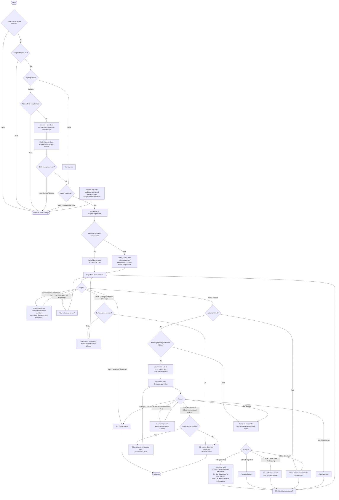

# Gesprächsablauf und sämtliche Ansagen

Stand des implementierten Dialogs. Texte in Anführungszeichen sind TTS-Ansagen.
`{Name}` stammt aus `callers[].name`, `{confirmation_text}` und `{success_text}`
aus der jeweiligen Aktion in der YAML. Die Bestätigungsfrage ist pro Aktion
optional und standardmäßig ausgeschaltet.
Ergebnistext und „Möchtest du noch etwas?“ werden zusammenhängend gesprochen.

Der Abbruchpfad gilt jederzeit, auch während einer Ansage oder Geräteaktion.
Beim Höchstzeitlimit gibt es derzeit keine zusätzliche Abschiedsansage. Fehlendes
Audio und technische Wiedergabefehler können ebenfalls ohne Ansage beenden.
Ein bereits gesendeter Gerätebefehl lässt sich durch Auflegen nicht zurücknehmen.

Nach einer Folgefrage kann direkt die nächste Aktion genannt werden; „Ja“ ist
nicht erforderlich. Dieselbe Aktion darf mehrfach angefordert werden und muss
bei eingeschalteter Bestätigungsfrage jedes Mal neu bestätigt werden. „Ja“ auf
die Folgefrage fordert einen neuen Auftrag an; es wiederholt keine alte Aktion.
Ohne Folge- oder Bestätigungsfrage wird „Ja“ als unklare Eingabe behandelt.

Bei einer Bestätigungsfrage brechen „Nein“, „Nein danke“, „Nee danke“, „Nö“ und
„Abbrechen“ nur die angefragte Aktion ab. Außerhalb dieser Bestätigungsfrage
beenden diese Wörter den Dialog. „Auflegen“ und „Tschüss“ beenden immer den Dialog
bei ausreichend sicherer Erkennung. Ein anderer Auftrag während der
Bestätigungsfrage wird nicht ausgeführt; die Frage zur ursprünglichen Aktion
wird erneut gestellt.

Standardwerte: 1 s Begrüßungspause, 3 s Rückrufpause, 15 s bis zum Antwortbeginn,
15 s ab erkanntem Sprechbeginn, 2 aufeinander folgende Verständnisfehler und
120 s maximale Gesprächsdauer. Spracherkennung und Echo-Schutzpause werden vor
dem Signalton vorbereitet; unmittelbar nach dem Ton beginnen Aufnahme und
Antwortfrist. Nach normalen Ansagen
kommt ein kurzer Signalton; nach einer Abschiedsansage wird direkt aufgelegt.
Während Ansagen und Befehlsausführung werden keine Sprachbefehle ausgewertet.

Ein kurzer Ton-/Geräuschimpuls ohne erkannten Text wird ignoriert. Dabei bleibt
das ursprüngliche Antwortfenster erhalten, auch bei einer Bestätigungsfrage.
Eine erkannte begonnene Äußerung bekommt ihre eigene, begrenzte Sprechfrist.

Die Nachfrage nennt aktuell fest „Haustür öffnen“, auch wenn nur andere Aktionen
aktiviert sind. Namen, Bestätigungsfragen und Erfolgsansagen sind variabel; die
übrigen hier gezeigten Ansagetexte stehen derzeit in `src/voice_home/dialog.py`.
Zusätzliche YAML-Aktionen bringen ihre eigene Erfolgsansage mit.
