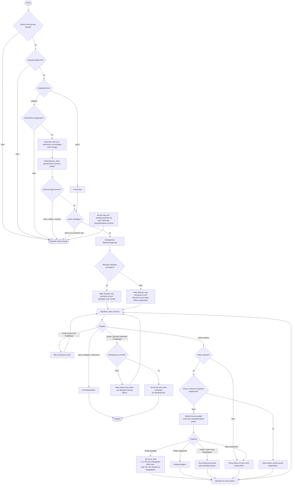

# Gesprächsablauf und sämtliche Ansagen

Stand des implementierten Dialogs. Texte in Anführungszeichen sind TTS-Ansagen.
`{Name}` stammt aus `callers[].name`, `{Ziele}` aus dem ersten Alias jeder
aktivierten Aktion, `{success_text}` aus der jeweiligen Aktion in der YAML.
Ergebnistext und „Möchtest du noch etwas?“ werden zusammenhängend gesprochen.

Der Abbruchpfad gilt jederzeit, auch während einer Ansage oder Geräteaktion.
Beim Höchstzeitlimit gibt es derzeit keine zusätzliche Abschiedsansage. Fehlendes
Audio und technische Wiedergabefehler können ebenfalls ohne Ansage beenden.
Ein bereits gesendeter Gerätebefehl lässt sich durch Auflegen nicht zurücknehmen.

Nach einer Folgefrage kann direkt die nächste Aktion genannt werden; „Ja“ ist
nicht erforderlich. „Ja“ ohne vorangehende Folgefrage wird als unklare Eingabe
behandelt. „Nein“, „Nein danke“, „Nee danke“, „Nö“, „Auflegen“, „Abbrechen“ und
„Tschüss“ beenden den Dialog bei ausreichend sicherer Erkennung.

Standardwerte: 1 s Begrüßungspause, 3 s Rückrufpause, 8 s Zuhörzeit, 2 aufeinander
folgende Verständnisfehler, 120 s maximale Gesprächsdauer. Nach normalen Ansagen
kommt ein kurzer Signalton; nach einer Abschiedsansage wird direkt aufgelegt.
Während Ansagen und Befehlsausführung werden keine Sprachbefehle ausgewertet.

Die Nachfrage nennt aktuell fest „Haustür öffnen“, auch wenn nur andere Aktionen
aktiviert sind. Namen, verfügbare Ziele und Erfolgsansagen sind variabel; die
übrigen hier gezeigten Ansagetexte stehen derzeit in `src/voice_home/dialog.py`.
Zusätzliche YAML-Aktionen bringen ihre eigene Erfolgsansage mit.
